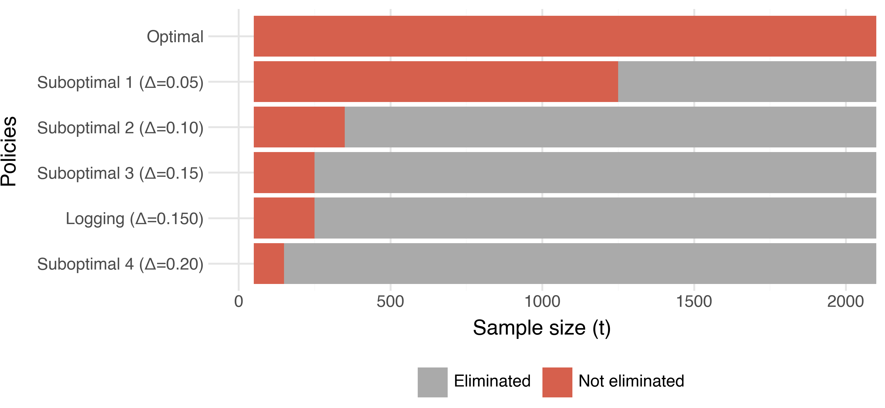
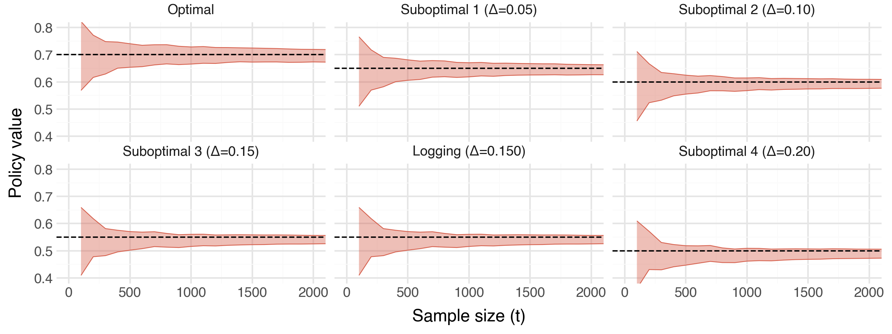
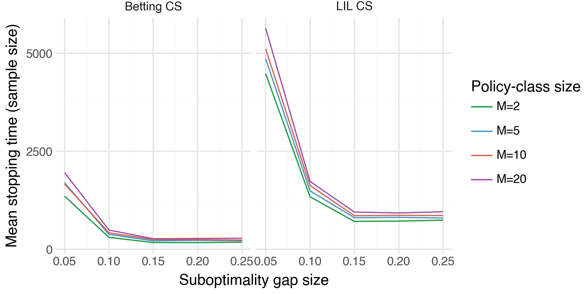
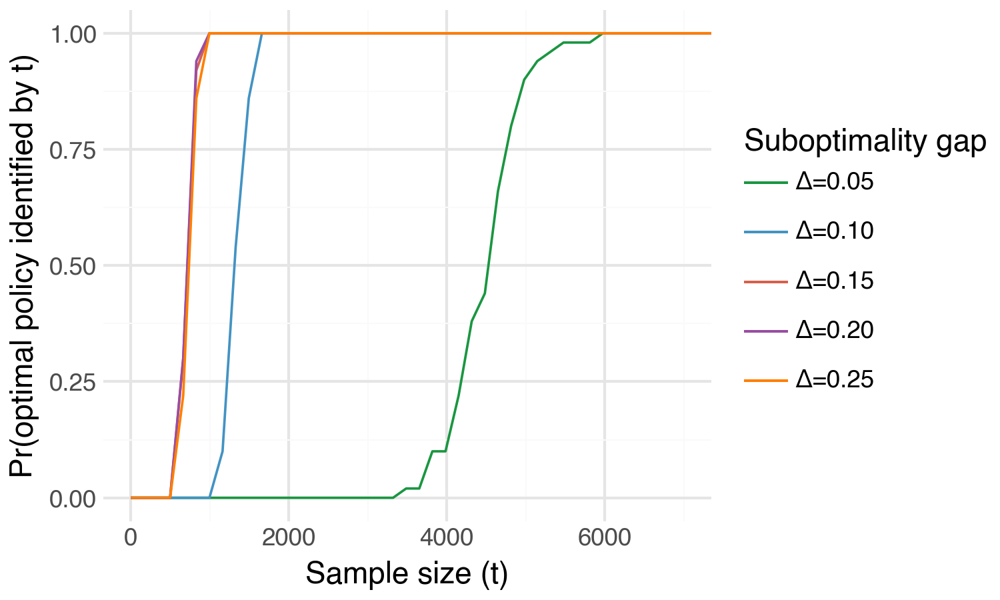
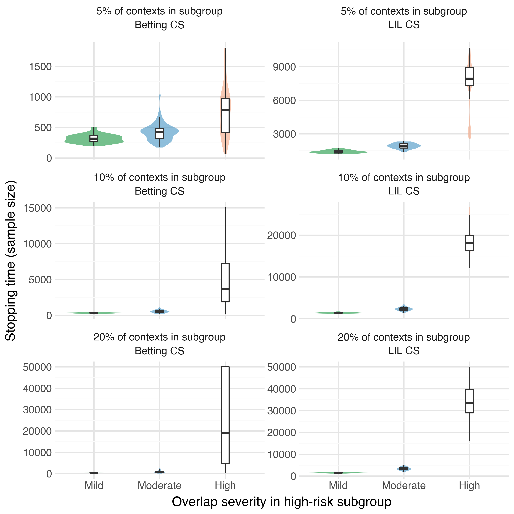
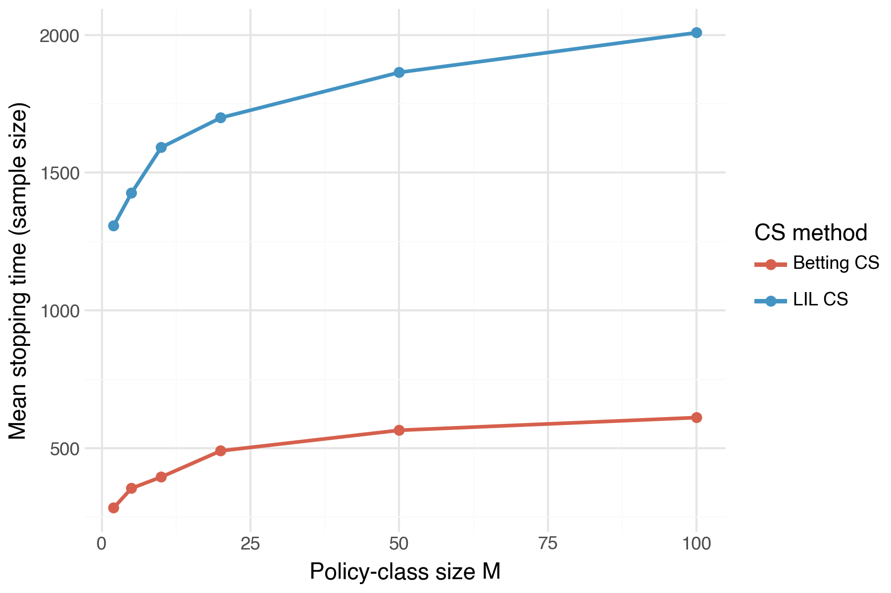

Suppose we work at a tech firm and are part of a team that is in charge of a personalization
algorithm. In particular, the existing personalization algorithm probabilistically assigns users to
certain interventions (treatments) based on their individual characteristics. Perhaps the team
would like to test a handful of cutting-edge personalization algorithms but are concerned
that replacing the current version would risk downgrading user satisfaction and incurring
significant costs. We would like to be able to continue collecting data with our existing
algorithm (the "status-quo") and concurrently identify which of the new algorithms would maximize
user outcomes (e.g. satisfaction, or click-through). In this blog post we'll demonstrate how
we can identify the outcome-maximizing algorithm with corresponding anytime-valid
inferential guarantees.

:::{.callout-note}
In this example, the personalization algorithm is a 
particular type of experimental design, but the method we discuss here is broadly
applicable across standard randomized designs, multi-arm bandits, and contextual bandits.
:::

## Bandit designs

The general (contextual) bandit problem can be described informally as follows. An agent
(in our case the personalization algorithm) views some contextual information $X_t \in \mathcal{X}$
for subject $t$ (their individual characteristics), assigns them to an intervention $A_t \in \mathcal{A}$
(e.g. to receive a particular advertisement), and observes some reward $R_t$
(e.g. whether the user clicks on it or not). Common examples are $\mathcal{X}$ as $d$-dimensional
Euclidean space, and $\mathcal{A}$ as a binary treatment in $\{0, 1\}$.

Our primary objective is to identify the optimal personalization algorithm --- the algorithm that
maximizes expected rewards (user outcomes). From here on, we will refer to the
personalization algorithms as policies (the typical verbiage in the literature). In our
setting, a policy $\pi(a | x)$ is simply a conditional distribution over interventions
given context $X_t$. We denote the expected reward under $\pi(a | x)$ as
$\nu(\pi) := \mathbb{E}_\pi[R]$. This setup generalizes to standard randomized designs 
and multi-arm bandits by setting the context to be constant across all units.
However, for the remainder of this post we'll assume that we're working with contextual
bandits.

Building on the methods of @waudby-smith_anytime-valid_2024, we will demonstrate how
to identify the outcome-maximizing policy from a collection of candidate policies,
all while collecting data using the status-quo policy (hereafter referred to as the
"logging" policy).

## Setup and notation

Much of the following notation is taken directly from @waudby-smith_anytime-valid_2024;
please see their excellent paper for further details. 

Let $\Pi=\{\pi_1,\dots,\pi_m\}$ denote a finite class of policies, where $m:=|\Pi|$. 
We observe contextual bandit data $(X_t,A_t,R_t)_{t\ge1}$ generated sequentially by 
a logging policy $(h_t)_{t\ge1}$.
The history at each unit $\mathcal H_t$ is comprised of all the information contained in
$(X_t,A_t,R_t)_{i-1}^t$. Formally, conditional on the past history $\mathcal H_{t-1}$ and 
the current context $X_t$, the intervention satisfies
$$
A_t \mid (X_t,\mathcal H_{t-1}) \sim h_t(\cdot \mid X_t),
$$
 
We assume the rewards satisfy $R_t\in[0,1]$ almost surely --- a common assumption
in contextual bandits. For our problem setup to be meaningful, we assume that we are working
in the time-invariant policy value setting: for each $\pi\in\Pi$, let
$$
\nu_t(\pi):=\mathbb{E}_\pi[R_t | \mathcal H_{t-1}],
$$
and assume that there exists a constant value $\nu(\pi)\in[0,1]$ such that $\nu_t(\pi)=\nu(\pi)$ for all $t\ge1$.
Let
$$
\pi^\star \in \arg\max_{\pi\in\Pi} \nu(\pi)
$$
denote an optimal policy.

With this notation in hand, we can now define a key component for estimating our target
estimands: $\nu(\pi) \ \forall \pi \in \Pi$.

### Doubly-robust pseudo-outcomes

:::{.callout-note}
We use the term doubly-robust in the sense of constructing regression-adjusted, inverse-weighted
pseudo-outcomes that enjoy variance reduction without compromising their validity. Doubly-robust
here does NOT imply that the statistical guarantees of our method rely on the regression model
being unbiased/consistent. In fact, the guarantees hold even when the regression
model is bad (e.g. misspecified, inconsistent, etc).
:::

For a candidate policy $\pi\in\Pi$, define the importance weight at unit $t$ as
$$
w_t(\pi):=\frac{\pi(A_t\mid X_t)}{h_t(A_t\mid X_t)}.
$$
Let $\widehat r_t(x,a)$ denote any $[0, 1]$-valued predictor of $R_t$ constructed from the 
history $\mathcal H_{t-1}$. Define the lower and upper doubly-robust pseudo-outcomes

$$
\begin{align}
\phi_t^{\mathrm{DRL}}(\pi)
&:= w_t(\pi)\!\left(R_t-\Big[\widehat r_t(X_t,A_t)\wedge \tfrac{k_t}{w_t(\pi)}\Big]\right) \notag\\
&\quad + \mathbb{E}_{a\sim\pi(\cdot\mid X_t)}
\!\left(\widehat r_t(X_t,a)\wedge \tfrac{k_t}{w_t(\pi)}\right), \\
\phi_t^{\mathrm{DRU}}(\pi)
&:= w_t(\pi)\!\left((1-R_t)-\Big[(1-\widehat r_t(X_t,A_t))\wedge \tfrac{k_t}{w_t(\pi)}\Big]\right) \notag\\
&\quad + \mathbb{E}_{a\sim\pi(\cdot\mid X_t)}
\!\left((1-\widehat r_t(X_t,a))\wedge \tfrac{k_t}{w_t(\pi)}\right).
\end{align}
$$

Next, we will demonstrate how to use these doubly-robust pseudo-outcomes to 
construct valid confidence sequences (CSs) for $\nu(\pi)$.

### CS construction

Let $k_1=k_2=\cdots = k \ge 0$ be a fixed constant and let $\xi_0 \in [0,(1+k)^{-1}]$. For $t \ge 1$, define the scaled doubly robust pseudo-outcomes
$$
\xi_t := \frac{\phi_t}{1+k},
$$
where $\phi_t := \phi_t^{\mathrm{DRL}}$ or $\phi_t^{\mathrm{DRU}}$, depending on which bound is being constructed. Then define
$$
\hat{\xi}_0 := \xi_0 \ ; \ \hat{\xi}_t := \left(\frac{1}{t}\sum_{i=1}^t \xi_i\right)\wedge \frac{1}{1+k},
$$
the variance process
$$
V_t := \sum_{i=1}^t (\xi_i - \hat{\xi}_{i-1})^2,
$$
and the stabilized version
$$
\bar V_t := V_t \vee 1.
$$

Let $\alpha \in (0,1)$ denote a significance level and define
$$
\ell_t(\alpha) := 2\log(\log \bar V_t + 1) + \log\left(\frac{1.65}{\alpha}\right).
$$

::: {.callout-tip}
## Proposition 3 of @waudby-smith_anytime-valid_2024

Using these quantities, we can construct a valid $1-\alpha$ lower CS for $\nu(\pi)$ as follows:
$$
L_t^{\mathrm{LIL}}(\pi; \alpha)
:= (k+1)\left(
\frac{1}{t}\sum_{i=1}^t \xi_i
-
\frac{\sqrt{2.13\,\ell_t(\alpha)\,\bar V_t + 1.76\,\ell_t(\alpha)^2}}{t}
-
\frac{1.33\,\ell_t(\alpha)^2}{t}
\right)\lor 0.
$$

Analogously, $U_t^{\mathrm{LIL}}(\pi;\alpha)$ denotes a $1-\alpha$ upper CS for $\nu(\pi)$
obtained by replacing $\phi_t^{\mathrm{DRL}}$ with $\phi_t^{\mathrm{DRU}}$ in all prior
quantities:
$$
U_t^{\mathrm{LIL}}(\pi; \alpha)
:= 1 - (k+1)\left(
\frac{1}{t}\sum_{i=1}^t \xi_i
-
\frac{\sqrt{2.13\,\ell_t(\alpha)\,\bar V_t + 1.76\,\ell_t(\alpha)^2}}{t}
-
\frac{1.33\,\ell_t(\alpha)^2}{t}
\right)\lor 0.
$$
:::

From here on, $\left[L_t^{\mathrm{LIL}}(\pi;\alpha), \ U_t^{\mathrm{LIL}}(\pi;\alpha)\right]$
will denote a valid two-sided $(1-\alpha)$ CS constructed by a union bound over the lower
and upper one-sided CSs, $L_t^{\mathrm{LIL}}(\pi;\alpha/2)$ and $U_t^{\mathrm{LIL}}(\pi;\alpha/2)$.

## Finding the optimal policy

With this CS machinery in place, we can pivot to the challenge of identifying
the optimal policy in $\Pi$. With a fixed, overall significance level $\alpha$, set the 
policy-level significance level to $\frac{\alpha}{m}$ for each $\pi\in\Pi$. It follows
by a union bound over $\pi \in \Pi$ that 
$$
\begin{equation}
\mathbb{P}\left(\nu(\pi) \in \left[L_t^\mathrm{LIL}\left(\pi; \frac{\alpha}{m}\right), U_t^\mathrm{LIL}\left(\pi; \frac{\alpha}{m}\right)\right]: \forall t \ge 1, \forall \pi \in \Pi \right) \ge 1 - \alpha.
\label{eq:simultaneous_coverage}
\end{equation}
$$

Now, we state our first main result:

:::{.callout-tip}
## Lemma 1 --- Optimal policy set $S_t$

Define the set
$$
S_t:=\left\{\pi\in\Pi:\ U_t^{\mathrm{LIL}}\left(\pi; \frac{\alpha}{m}\right)\ \ge\ \max_{\pi'\in\Pi} L_t^{\mathrm{LIL}}\left(\pi'; \frac{\alpha}{m}\right)\right\}
$$
and the set of optimal policies
$$
\Pi^* := \left\{\pi \in \Pi : \nu(\pi) = \underset{\pi'\in\Pi}{\max}\ \nu(\pi') \right\}.
$$
Then,
$$
\mathbb{P}\left(\Pi^* \subseteq S_t : \forall t \ge 1\right) \ge 1 - \alpha.
$$
:::

$S_t$ utilizes a simple elimination strategy that trims clearly-sub-optimal policies until the optimal policy set is identified with probability $\ge 1-\alpha$. This guarantee holds uniformly across
all sample sizes $t$ and thus is anytime-valid .

### Stopping/Identification time and sample complexity

Suppose that there is a unique optimal policy $\pi^*$. Define the suboptimality gap for each $\pi \neq \pi^*$ by
$$
\Delta_\pi := \nu(\pi^*) - \nu(\pi),
$$
and define
$$
\Delta_{\min} := \min_{\pi \neq \pi^*}\Delta_\pi > 0.
$$

Under minimal assumptions, this leads to the following natural stopping time definition and corresponding
sample complexity result:

:::{.callout-tip}
## Theorem 1 --- Stopping time and sample complexity rate

Define the stopping time
$$
\tau:=\inf\left\{t\ge1:\ \exists \pi'\in\Pi\ \text{s.t.}\ L_t^{\mathrm{LIL}}\left(\pi';\frac{\alpha}{m}\right)\ >\ \max_{\pi \neq \pi'} U_t^{\mathrm{LIL}}\left(\pi;\frac{\alpha}{m}\right)\right\}.
$$
Then, with probability at least $1-\alpha$, the following holds:
$\tau < \infty$, $S_\tau = \{\pi^*\}$, and there exist constants $N>0$, $m_0 \ge 1$, and $\Delta_0 \in (0,1)$ such that for all $m \ge m_0$ and all $0<\Delta_{\min}\le \Delta_0$,
$$
\tau \le N\,\frac{\log m + \log\log(1/\Delta_{\min})}{\Delta_{\min}^2}.
$$
Equivalently,
$$
\tau = O\!\left(\frac{\log m + \log\log(1/\Delta_{\min})}{\Delta_{\min}^2}\right) \qquad \text{as } m\to\infty \text{ and } \Delta_{\min}\downarrow 0.
$$
:::

This sample complexity bound provides intuition on how we should expect the sample size required
to identify $\pi^*$ to grow as a function of $\Delta_{\min}$ and $m$: while increasing the
number of candidate policies $\left(m\right)$ increases the required sample, it does so slowly
(basically a log rate); in contrast,
as the suboptimality gap $\Delta_{\min}$ gets smaller, the required sample grows at a
rapid rate $\left(\frac{1}{\Delta_{\min}^2}\right)$ which quickly dominates the increase caused by $m$.
In short, the sample required to identify $\pi^*$ relies _heavily_ on
how big/small $\Delta_{\min}$ is.

## Empirical demonstrations

Now for the fun part! We can demonstrate the utility of these methods via some simulations.

### Data-Generating Process

All of the following demos (except Demo 4) share the same DGP. Contexts include
three variables sampled independently $X_t = (X_1, X_2, X_3)_t \sim \text{Uniform}(0, 1)^3$,
binary treatment $A_t \in \{0, 1\}$, and the following reward model:
$$
R_t \sim \text{Beta}(\mu(X_t, A_t)*\kappa, \ (1-\mu(X_t, A_t))*\kappa),
$$

where $\kappa = 3$ and $\mu(X_t, A_t) = \beta_{A_t, 0} + 0.1\left(X_1 + X_2 + X_3 \right)$.

| Action | Intercept $\beta_{A_t, 0}$ | $\mathbb{E}[R | A]$ |
|--------|------------------|-----------|
| $A_t$ = 0  | 0.25 | 0.40      |
| $A_t$ = 1  | 0.55 | 0.70      |

Since both actions share the same covariate slopes, the optimal action does not depend on context.
The logging policy is $h(A_t=1|X) = 0.5$ (uniform randomization). All competing policies
$\pi \in \Pi$ assign $\pi(A_t=1|X)=p$ for some $p\in [0, 1]$ independently of context, resulting
in policy value $\nu(\pi)=0.7p + 0.4(1-p)$. The logging policy value is $\nu(h) = 0.55$. The
overall significance level is $\alpha=0.1$. Finally, our reward predictor $\hat{r}_t$ is
an OLS estimator fitted on $\left(\left(X_1, X_2, X_3\right)_i, A_i \right)_{i=1}^{t-1}$.
Our stopping rule stops at the first $t$ when $S_t$ collapses to a single policy
(the identified optimal policy).

### Demos

#### Demo 1 --- Simultaneous inference on $\pi^*$ and $\nu(\pi)$

**What it shows:** These plots combine to demonstrate how, as we collect data,
we can perform simultaneous inference on the optimal policy $\pi^*$ and the true policy
values $\nu(\pi)$ for all $\pi \in \Pi$. In the top panel we see the
progression of $S_t$ and how sub-optimal policies are progressively
eliminated until uniquely identifying $\pi^*$ at approximately $t=1,300$. In the bottom panel,
we see the CSs for each policy converging towards the true underyling policy value (denoted by
the black, dashed horizontal line).

**Setup:**

- We simulate a single experiment with a maximum sample horizon of $T=$ 15,0000.

---

#### Demo 2 --- Stopping time vs. sub-optimality gap and policy-class size

**What it shows:** How the stopping time $\tau$ scales with the suboptimality gap $\Delta_{\min}$
and the size of our policy class $m$. As expected, we see that the sample size required to
uniquely identify $\pi^*$ decreases across both $\Delta_{\min}$ and $m$.

**Setup:**

- We simulate an experiment with a maximum sample horizon of $T=15,0000$.
- We evaluate the following grid $\Delta_{\min} \in \{0.05, 0.10, 0.15, 0.20, 0.25\}; \ m \in \{2, 5, 10, 20\}$.
- We run N = 50 trials per $(\Delta_{\min}, m)$ pair.
- For this and all remaining demos, we display results with two different types of CSs: LIL CSs (the CSs defined above), and Betting CSs (an alternative CS introduced by @waudby-smith_anytime-valid_2024).
We will see that the Betting CSs uniformly outperform the LIL CSs.

---

#### Demo 3 --- Optimal policy identification probability curve

**What it shows:** The probability of uniquely identifying $\pi^*$ as a function of sample size
$t$ --- the "detection power curve" of the method. Intuitively, we can uniquely identify $\pi^*$
with high probability far more quickly for larger values of $\Delta_{\min}$.

**Setup:** Basically a re-formulation of what we show in Demo 2. We plot the optimal policy
identification probability across a grid of $\Delta_{\min} \in \{0.05, 0.10, 0.15, 0.20, 0.25\}$
but for a fixed policy class size, $m=2$.

---

#### Demo 4 --- Stopping time under weak oerlap

Suppose that in our population of subjects there exists a high-risk subgroup. For safety reasons,
amongst this high-risk subgroup our logging policy can only assign the treatment condition with
very low probability, e.g. $h(A_t=1 | X_{\text{high-risk}}) = 0.005$. However, we may still be
interested in understanding what our expected reward would be under a target policy $\pi$ that
assigns the high-risk subgroup to the treatment condition with high probability, e.g.
$\pi(A_t=1 | X_{\text{high-risk}}) = 0.9$. In this scenario, which we will refer to as weak
overlap, the individual importance weights are $w_t = \frac{0.9}{0.001} = 900$. In this demo
we want to explore how sample requirements for optimal policy identification change
under weak overlap.

**What it shows:** How weak overlap between the logging policy $h$ and a target policy $\pi$ in a
subset of the covariate space can inflate the stopping time. We plot the empirical distribution
of stopping time under both types of CSs across a grid of increasing weak overlap severity.
As expected, we see that the sample requirements for identifying $\pi^*$ increase tremendously
under significant weak overlap.

**Setup:**

In this demo, we stray slightly from our standard DGP:

- **Context:** We draw a single covariate $X \sim \text{Uniform}(0, 1)$.
- **Reward:** The reward model remains the same as before, but with a single covariate.
- **Logging policy:** We will define the high-risk subgroup as all individuals whose covariate
$X_t < \text{fraction}_\text{hr}$ where $\text{fraction}_\text{hr} \in [0, 1]$ determines
the proportion of the population that fall in the high-risk subgroup.
For example, $\text{fraction}_\text{hr} = 0.1$ determines that 10% of the population falls
in the high-risk subgroup. We then define the logging policy as
$$
h(A_t = 1 \mid X_t)
=
\begin{cases}
p_{\mathrm{hr}}, & \text{if } X_t < \mathrm{fraction}_{\mathrm{hr}},\\[6pt]
0.50, & \text{otherwise.}
\end{cases}
$$
where $p_\text{hr}$ is some very small value.
- **Weak overlap severity:** We set the optimal policy in $\Pi$ as
$\pi^*(A_t = 1 | X_t) = 1$ (always assign to treatment).
The resulting max importance weight in the high-risk
subgroup is $w_{\max} = 1 / p_\text{hr}$. The table below delineates the
levels of weak overlap severity we will investigate.

    | Severity  | $p_\text{hr}$   | $w_{\max}$ |
    |-----------|---------|---------|
    | Mild      | 1/3     | 3       |
    | Moderate  | 0.10    | 10      |
    | High      | 0.01    | 100     |
    <!-- | Severe    | 1/300   | 300     | -->

- **High-risk subgroup sizes:** We will also evaluate weak overlap over the following
grid of high-risk subgroup sizes: $\text{fraction}_\text{hr} \in \{0.05, 0.10, 0.20\}$
(5%, 10%, 20% of contexts).
- **Policies:** We have one optimal policy and two sub-optimal policies for a total of $m=3$
and we run N = 50 trials for each $\left(p_\text{hr}, \ \text{fraction}_\text{hr}\right)$ pair.

---

#### Demo 5 --- Stopping time vs. policy class size $m$

**What it shows:** How sample size needed to identify $\pi^*$ scales with the policy class size $m$.
We plot the mean sample size across a grid of $m$ values. As implied by the sample complexity
bound in Theorem 1, we see that sample size increases in $m$, but at a rapidly decreasing rate.

**Setup:**

- Fix $\Delta_{\min} = 0.10$. Then evaluate mean stopping size across the following grid:
$m \in \{2, 5, 10, 20, 50, 100\}$.
- Calculate the mean sample size across N = 30 trials per $m$ value.

## Summary

In this post we have explored the setting where we have an existing ("status-quo") intervention
assignment policy and would like to test a handful of new policies to find which
one maximizes the outcomes of our subjects. In particular, we have demonstrated how
we can minimize risk by continuing to collect data with the status-quo policy
while concurrently evaluating the full set of new policies on the collected data until
we have identified which is the optimal policy. In addition, we can simultaneously do
inference on the true expected outcomes under each of our new policies.