2025 was a great year for music!

Particularly in recent years, a fair amount of ink has been spilled about how the musical album
is dying. This sentiment has continued to grow as streaming services dominate
the musical distribution landscape, creating a premium for singles and other shorter, more digestible
units of musical output. As a result, I decided that, on principle, I was going to make an effort to listen to more full albums in 2025. I've always had an affinity for listening to full albums anyways so this was a pretty easy decision for me. Below, I catalogue my _favorite_ albums of the year, some _honorable mentions_, and finally some of my _least favorite_ albums! I pretty much don't listen to albums that I don't at least think I _might_ enjoy. As a result I end up listening to a lot more albums that I do enjoy than those that I don't.

Without further ado, the following are my favorite albums of the year:

## Favorite Albums

```{=html}
<div style="display:grid; grid-template-columns: 140px 1fr; gap: 18px; align-items:start; margin: 22px 0;">

  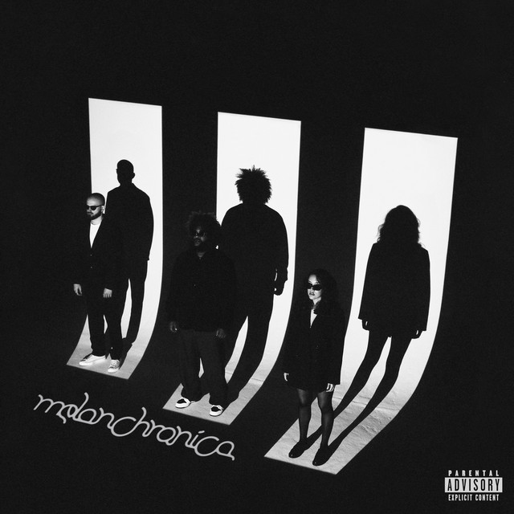

  <div>
    <div style="font-weight:700; font-size:1.2em; line-height:1.2;">
      Melanchronica <span style="font-weight:400; opacity:0.8;">— Bas & The Hics</span>
    </div>

    <div style="margin-top:8px;">
      Since <i>Too High to Riot</i>, Bas has teamed up with The Hics
      for a variety of features, but this is their first full-length co-feature.
      The Hics provide an unexpected (instrumental, indie rock, neo-soul), but sonically delightful, alternative to what you're used to getting from Bas. <i>Melanchronica</i> is unique but cohesive
      and was my favorite album of the year.
    </div>
  </div>

</div>
```

---

```{=html}
<div style="display:grid; grid-template-columns: 140px 1fr; gap: 18px; align-items:start; margin: 22px 0;">

  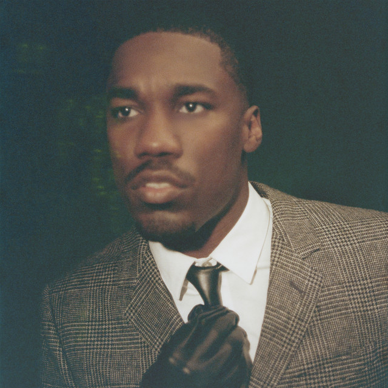

  <div>
    <div style="font-weight:700; font-size:1.2em; line-height:1.2;">
      BELOVED <span style="font-weight:400; opacity:0.8;">— Giveon</span>
    </div>

    <div style="margin-top:8px;">
      After <i>TAKE TIME</i>, Giveon's sound has trended from alternative R&B towards
      a more commercial sound, which has led to me not enjoying his recent releases as much.
      As a result, <i>BELOVED</i> was a very pleasant surprise! Although the
      individual songs sometimes lack a bit of uniqueness, the album as a whole is an extremely easy listen. I found myself continuing to come back to this album, especially when I
      wanted something that I could enjoy front-to-back.
    </div>
  </div>

</div>
```

---

```{=html}
<div style="display:grid; grid-template-columns: 140px 1fr; gap: 18px; align-items:start; margin: 22px 0;">

  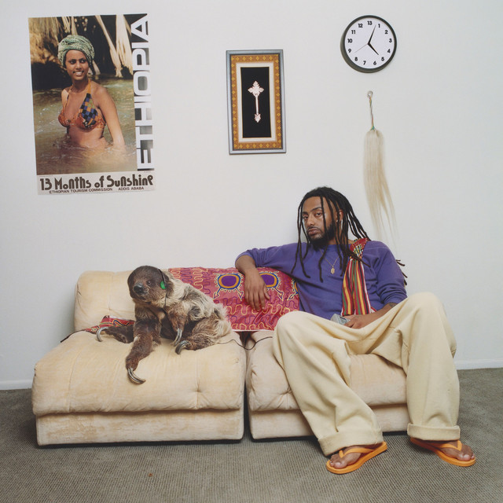

  <div>
    <div style="font-weight:700; font-size:1.2em; line-height:1.2;">
      13 Months of Sunshine <span style="font-weight:400; opacity:0.8;">— Aminé</span>
    </div>

    <div style="margin-top:8px;">
      13MOS delivers exactly what it promised. From <i>New Flower</i> to <i>Cool About It</i> to <i>Arc de Triomphe</i>, the production is smooth, peppy, and bright; it feels like summer. Despite
      a handful of filler songs that are consistently skips from me, I had 13MOS on repeat throughout much of 2025.
    </div>
  </div>

</div>
```

---

```{=html}
<div style="display:grid; grid-template-columns: 140px 1fr; gap: 18px; align-items:start; margin: 22px 0;">

  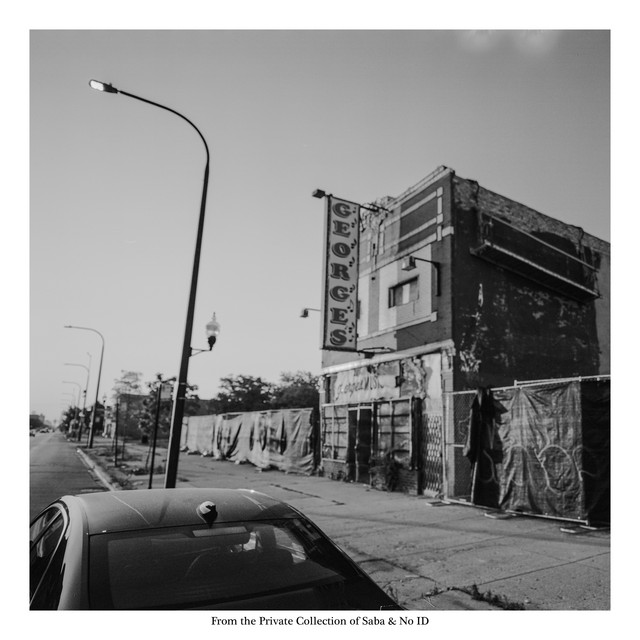

  <div>
    <div style="font-weight:700; font-size:1.2em; line-height:1.2;">
      From The Private Collection of Saba and No ID <span style="font-weight:400; opacity:0.8;">— Saba & No ID</span>
    </div>

    <div style="margin-top:8px;">
      FTPC is a fascinating album. There are only a couple songs (<i>Westside Bound Pt. 4</i>, <i>30secchop</i>) that I love as standalone songs. Despite that, this album has the best
      internal consistency of any other 2025 album; each track pairs immaculately with the surrounding
      tracks, resulting in an album where the whole is greater than the sum of its parts. FTPC exemplifies the attention to detail and overarching vision of a good album and was one of my favorites of 2025.
    </div>
  </div>

</div>
```


---

```{=html}
<div style="display:grid; grid-template-columns: 140px 1fr; gap: 18px; align-items:start; margin: 22px 0;">

  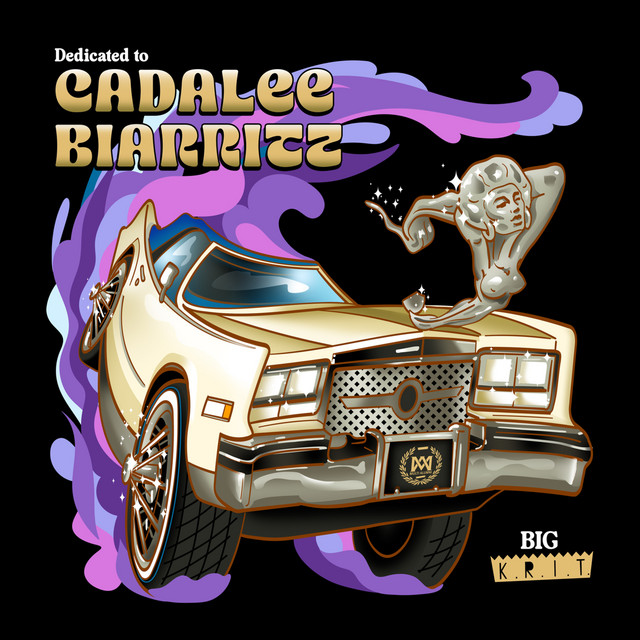

  <div>
    <div style="font-weight:700; font-size:1.2em; line-height:1.2;">
      Dedicated to Cadalee Biarritz <span style="font-weight:400; opacity:0.8;">— Big K.R.I.T.</span>
    </div>

    <div style="margin-top:8px;">
      It's been a minute since Krit dropped anything, and even longer since his most classic stuff. I had low expectations going in to the first listen, and finished feeling like it was maybe his best since <i>4eva Is A Mighty Long Time</i>. Consisting of a nice mix of Southern trunk-thumpers and smooth jams, Cadalee Biarritz was sonically one of the easiest listens of 2025.
    </div>
  </div>

</div>
```

## Honorable Mentions

The following albums are my honorable mentions. These albums lack the consistency
of my favorites, but are still fantastic albums and contain some of my favorite songs of the year:

```{=html}
<div style="display:grid; grid-template-columns: 140px 1fr; gap: 18px; align-items:start; margin: 22px 0;">

  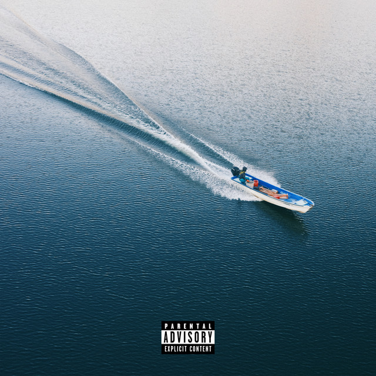

  <div>
    <div style="font-weight:700; font-size:1.2em; line-height:1.2;">
      Life Is Beautiful <span style="font-weight:400; opacity:0.8;">— Larry June, 2 Chainz, & The Alchemist</span>
    </div>

    <div style="margin-top:8px;">
      Larry June and 2 Chainz teaming up was not something I had on my 2025 bingo card, but their
      styles pair surprisingly well. Against the backdrop of The Alchemist's customarily crisp,
      smooth beats, this album scores high in the vibes department. <i>Life is Beautiful</i>
      has low lows, and extremly high highs; approximately 1/2 are songs that I wouldn't miss
      if they were removed, while the other 1/2 includes some of my favorites
      of 2025, such as <i>Life Is Beautiful</i> and <i>Jean Prouvé</i>.
    </div>
  </div>

</div>
```

---

```{=html}
<div style="display:grid; grid-template-columns: 140px 1fr; gap: 18px; align-items:start; margin: 22px 0;">

  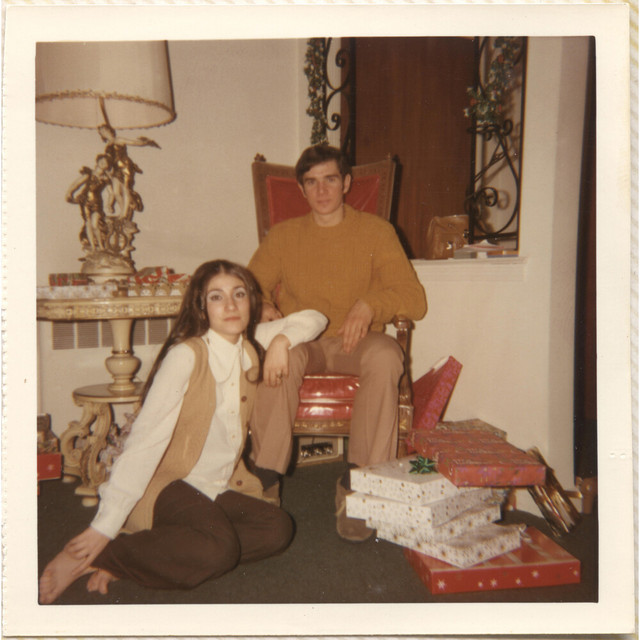

  <div>
    <div style="font-weight:700; font-size:1.2em; line-height:1.2;">
      FATHER FIGURE <span style="font-weight:400; opacity:0.8;">— Jon Bellion</span>
    </div>

    <div style="margin-top:8px;">
      <i>FATHER FIGURE</i> was a bit of Jon Bellion renaissance for me. He proved his hitmaking abilities
      with songs including <i>KID AGAIN</i> and <i>WASH</i>. I also really appreciate the threads of
      finding purpose, true success, and fatherhood that he carries throughout the album. A
      thoroughly enjoyable album on multiple dimensions.
    </div>
  </div>

</div>
```

---

```{=html}
<div style="display:grid; grid-template-columns: 140px 1fr; gap: 18px; align-items:start; margin: 22px 0;">

  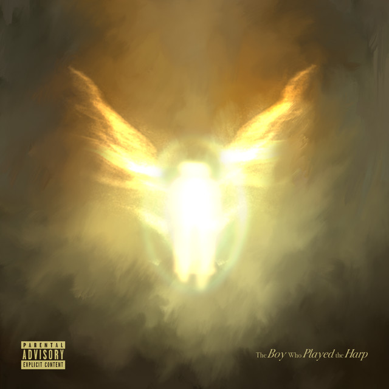

  <div>
    <div style="font-weight:700; font-size:1.2em; line-height:1.2;">
      The Boy Who Played the Harp <span style="font-weight:400; opacity:0.8;">— Dave</span>
    </div>

    <div style="margin-top:8px;">
      Leaning heavily into instrumental tracks and vocal features/samples, <i>The Boy Who Played the Harp</i>
      strays far from the beaten path. This album is a melodic journey of introspection on success,
      legacy, and change (both social and personal) that is both thought-provoking and beautiful.
    </div>
  </div>

</div>
```

---

```{=html}
<div style="display:grid; grid-template-columns: 140px 1fr; gap: 18px; align-items:start; margin: 22px 0;">

  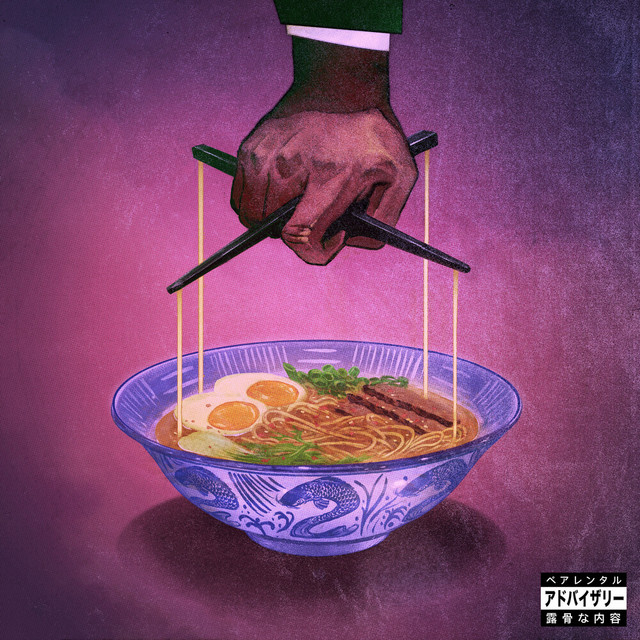

  <div>
    <div style="font-weight:700; font-size:1.2em; line-height:1.2;">
      Alfredo 2 <span style="font-weight:400; opacity:0.8;">— Freddie Gibbs & The Alchemist</span>
    </div>

    <div style="margin-top:8px;">
      <i>Alfredo 2</i> elevates The Alchemist's legendary recent run and continues to cement his place as
      one of the elite producers of our generation. Although this album lacks the depth and consistency
      of its iconic predecessor, <i>Alfredo</i>, it still delivers glimpses of brilliance
      throughout (see <i>1995</i>, <i>Ensalada</i>, <i>Shangri La</i>, etc.).
    </div>
  </div>

</div>
```

---

```{=html}
<div style="display:grid; grid-template-columns: 140px 1fr; gap: 18px; align-items:start; margin: 22px 0;">

  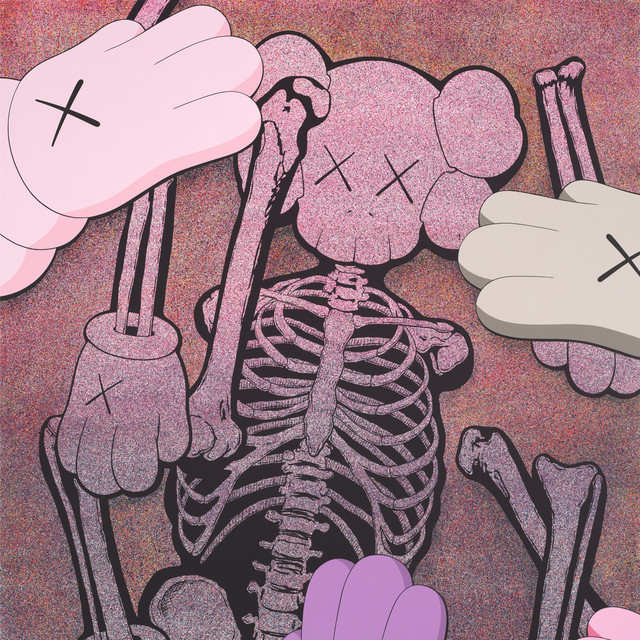

  <div>
    <div style="font-weight:700; font-size:1.2em; line-height:1.2;">
      Let God Sort Em Out <span style="font-weight:400; opacity:0.8;">— Clipse</span>
    </div>

    <div style="margin-top:8px;">
      <i>Let God Sort Em Out</i> was one of the most polarizing albums of 2025 for me. A handful
      of songs (<i>The Birds Don't Sing</i>, <i>E.B.I.T.D.A.</i>, <i>F.I.C.O.</i>, <i>Let God Sort Em Out/Chandeliers</i>) to me were elite, while the others were consistent skips. This lack of consistency
      kept this (barely) from being one of my favorites of 2025.
    </div>
  </div>

</div>
```

---

```{=html}
<div style="display:grid; grid-template-columns: 140px 1fr; gap: 18px; align-items:start; margin: 22px 0;">

  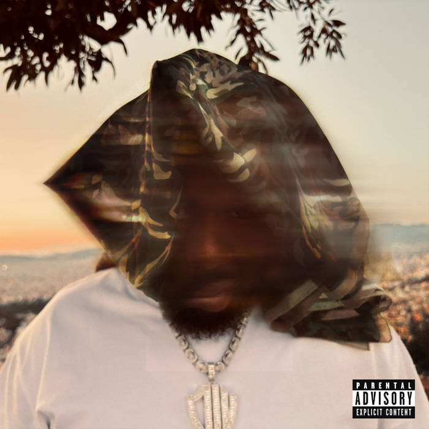

  <div>
    <div style="font-weight:700; font-size:1.2em; line-height:1.2;">
      You Can't Kill God With Bullets <span style="font-weight:400; opacity:0.8;">— Conway the Machine</span>
    </div>

    <div style="margin-top:8px;">
      As someone who has historically slept on Conway the Machine, <i>You Can't Kill God With Bullets</i>
      far exceeded any of my expectations. This album creates a gratifying tension, combining smooth, commercial beats (<i>The Lightning Above The Adriatic Sea</i>; <i>Parisian Nights</i>) with classic boom bap (<i>Crazy Avery</i>; <i>Mahogany Walls</i>). This was the last 2025 album I listened to and, with a little more listening time, could easily have become one of my favorites.
    </div>
  </div>

</div>
```

## Least Favorites

Life isn't all lilies and roses, and unfortunately neither are all the albums I listened to in 2025.
Lest this be interpreted as me being a hater, I'm mostly not! In general these albums were just like
drinking flat soda; not objectively horrid but not something I'm going to ingest on purpose. With that
out of the way, let's begin:

```{=html}
<div style="display:grid; grid-template-columns: 140px 1fr; gap: 18px; align-items:start; margin: 22px 0;">

  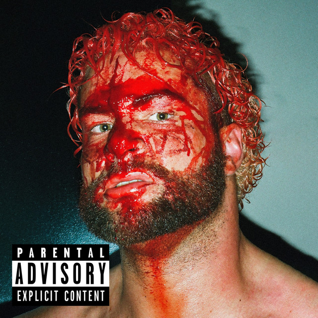

  <div>
    <div style="font-weight:700; font-size:1.2em; line-height:1.2;">
      HEELS HAVE EYES 2 <span style="font-weight:400; opacity:0.8;">— Westside Gunn</span>
    </div>

    <div style="margin-top:8px;">
      Unfortunately, Westside Gunn is just not my cup of tea. I really don't vibe with his voice and I
      <i>hate</i> his adlibs. This has the unfortunate effect of making me unable to truly enjoy his
      albums. <i>HEELS HAVE EYES 2</i> is no exception. It's like the opposite of the Midas touch.
      Even the beats that I really like (<i>AMIRA KITCHEN</i>; <i>PRICK</i>) turn sour when I hear
      Westside Gunn on them.
    </div>
  </div>

</div>
```

---

```{=html}
<div style="display:grid; grid-template-columns: 140px 1fr; gap: 18px; align-items:start; margin: 22px 0;">

  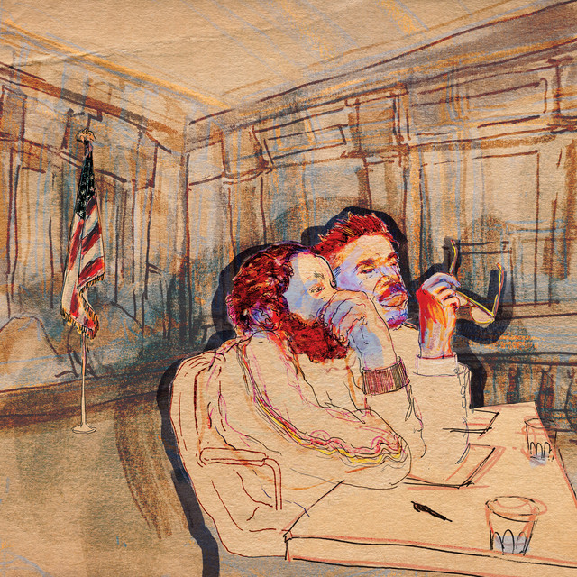

  <div>
    <div style="font-weight:700; font-size:1.2em; line-height:1.2;">
      Mercy <span style="font-weight:400; opacity:0.8;">— Armand Hammer & The Alchemist</span>
    </div>

    <div style="margin-top:8px;">
      <i>Mercy</i> marries intricate, dark beats with complex, disjointed rhymes. It almost
      feels like listening to a chaotic dream. The result was an album that I didn't
      fully understand or particularly enjoy. There was, however, one prominent outlier;
      <i>Calypso Gene</i> was one of my absolute favorite songs of 2025.
    </div>
  </div>

</div>
```

---

```{=html}
<div style="display:grid; grid-template-columns: 140px 1fr; gap: 18px; align-items:start; margin: 22px 0;">

  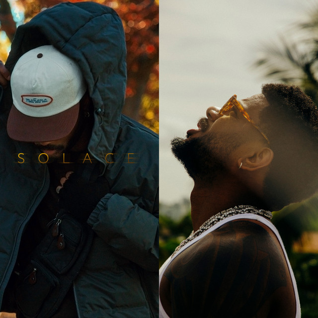

  <div>
    <div style="font-weight:700; font-size:1.2em; line-height:1.2;">
      Solace & The Vices <span style="font-weight:400; opacity:0.8;">— Bryson Tiller</span>
    </div>

    <div style="margin-top:8px;">
      Since dropping one of the 2010's (all-time?) most influential R&B albums in <i>TRAPSOUL</i>,
      it feels like Bryson Tiller is still searching for that same spark. <i>Solace & The Vices</i>
      is not terrible; it just feels slightly boring and monolithic.
    </div>
  </div>

</div>
```

---

```{=html}
<div style="display:grid; grid-template-columns: 140px 1fr; gap: 18px; align-items:start; margin: 22px 0;">

  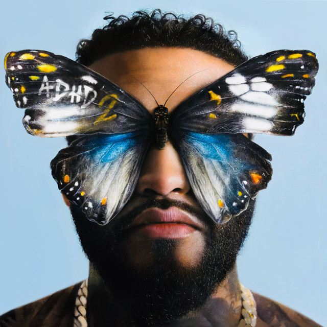

  <div>
    <div style="font-weight:700; font-size:1.2em; line-height:1.2;">
      ADHD 2 <span style="font-weight:400; opacity:0.8;">— Joyner Lucas</span>
    </div>

    <div style="margin-top:8px;">
      At the risk of sounding like a broken record, my issue with <i>ADHD 2</i> is more of the same.
      If this was the first Joyner Lucas album I ever heard, I would probably enjoy it. But it's not.
      It lacked a sense of creativity and originality; every song felt like I had already heard it before.
      This is the first Joyner Lucas release in years that I haven't enjoyed, and I hope that he can have a
      return to form moving forward.
    </div>
  </div>

</div>
```

Despite these underwhelming records, 2025 delivered many more hits than misses and I feel confident
that 2026 will be more of the same. Until then, happy listening!