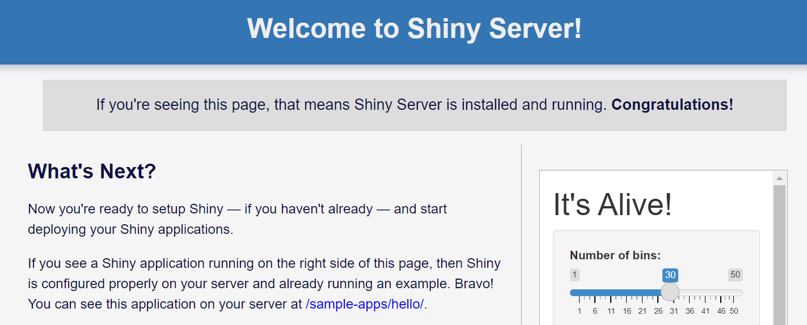

```{r setup, include=FALSE}
knitr::opts_chunk$set(comment = "#",
                      eval = TRUE,
                      echo = TRUE,
                      warning = FALSE,
                      message = FALSE)
set.seed(123) # for replicating the results
options(scipen = 999)
```

Because of the number of computing platforms and the varied processes involved
in setting up a virtual machine (VM) on each of them, this tutorial will begin 
under the assumption that you have already established and connected to a 
suitable VM. For my own personal uses I am using a Digital Ocean VM with 
Ubuntu 20.04 as the OS.

Additionally, this document is effectively just a personal wiki and some steps
are pretty specific to my own setup so mileage may vary.

## Install R/Shiny Server and all dependencies

The first step is to install the most recent version of R, as well as a robust
set of the most important R packages.
{}
This installation will take >= 2 hrs on most VMs.
{}
```
# Install the dependencies necessary to add a new repository over HTTPS:
sudo apt-get -y install \
    dirmngr \
    gnupg \
    apt-transport-https \
    ca-certificates \
    software-properties-common

# Add the CRAN repository to your system sources list:
sudo apt-key adv \
    --keyserver keyserver.ubuntu.com \
    --recv-keys E298A3A825C0D65DFD57CBB651716619E084DAB9
sudo add-apt-repository 'deb https://cloud.r-project.org/bin/linux/ubuntu focal-cran40/'

# Install base R and dependencies for full set of R packages
sudo apt-get -y install \
    r-base \
    r-base-dev \
    libssl-dev \
    libcurl4-openssl-dev \
    libxml2-dev \
    libfontconfig1-dev \
    libcairo2-dev \
    libgmp3-dev \
    libmpfr-dev \
    libv8-dev \
    unixodbc-dev \
    libpq-dev \
    libudunits2-dev \
    libgdal-dev \
    gsl-bin \
    libgsl0-dev \
    libharfbuzz-dev \
    libfribidi-dev \
    cmake

# Install R packages
sudo R -e 'install_pkgs <- function(pkgs) invisible(lapply(pkgs, function(i) { if (!requireNamespace(i, quietly = TRUE)) install.packages(i) })); install_pkgs(read.table("link/to/RIPL/toolkit/R/packages")[["V1"]])'
```

Once R and the packages have been installed, the next step is to install Shiny
Server and all its dependencies.
```
# Install Shiny Server and dependencies
sudo apt-get -y install gdebi-core
wget https://download3.rstudio.org/ubuntu-14.04/x86_64/shiny-server-1.5.17.973-amd64.deb
sudo gdebi -n shiny-server-1.5.17.973-amd64.deb
```

## Verify Shiny Server is running

Locate the public IP of your VM and in your web browser enter 
`http://vm.public.ip:3838/`. If Shiny Server is active and running correctly, 
you should see something like the following:


## Configure Shiny Server as Git repo

```
# Ensure shiny-server directory has full read/write permissions
sudo chmod -R 777 /srv/shiny-server

# Generate new SSH key for connecting to Github (just hit enter for all prompts)
ssh-keygen -t ed25519
eval "$(ssh-agent -s)"
ssh-add ~/.ssh/id_ed25519
```

The steps above generate a new SSH key, but now you must add this SSH key to 
your Github account. To do so, follow the steps in 
[this article](https://docs.github.com/en/authentication/connecting-to-github-with-ssh/adding-a-new-ssh-key-to-your-github-account) closely. Now that you’ve added the SSH key to your Github account, 
it’s time to configure your Github credentials and clone your Shiny Server repo 
to the VM. To do this, execute:
```
# Configure git credentials
git config --global user.email "you@example.com"
git config --global user.name "Your Name"

# Navigate to shiny-server directory
cd /srv/shiny-server
sudo rm -r *
git init

# Clone repo
git remote add origin git@github.com:path-to-repo-head.git
git pull origin master
git branch --set-upstream-to=origin/master master
cd ~
```

## Install and configure nginx

```
# Install nginx
sudo apt-get -y install nginx

# Edit nginx config
sudo vi /etc/nginx/sites-enabled/default
```
This will open the `nginx` config file. Add the following lines **above** the 
line that reads `server {`

```
map $http_upgrade $connection_upgrade {
  default upgrade;
  ''      close;
}
```
And add the following lines right **after** the line that reads `server_name _;`
```
location /shiny/ {
  proxy_pass http://127.0.0.1:3838/;
  proxy_http_version 1.1;
  proxy_set_header Upgrade $http_upgrade;
  proxy_set_header Connection $connection_upgrade;
  rewrite ^(/shiny/[^/]+)$ $1/ permanent;
}
```

Now, save the changes. Since you edited the `nginx` config file you will need to
restart the service with `sudo service nginx restart`. Now, instead of accessing 
Shiny Server with `http://vm.public.ip:3838` you should be able to access it 
with `http://vm.public.ip/shiny`.

The final step in configuring `nginx` is to overwrite the default .html landing 
page with a personalized landing page.
{}
This assumes that you have a file named
`index.nginx-debian.html` in the root of your `shiny-server` github repo.
{}
```
sudo cp -rf /srv/shiny-server/index.nginx-debian.html /var/www/html/
```
Now, when you access `http://vm.public.ip`, you should see a pretty landing 
page.

## Conclusion

You have now configured Shiny Server and can view it at 
`http://vm.public.ip/shiny/`! 🎉🥳